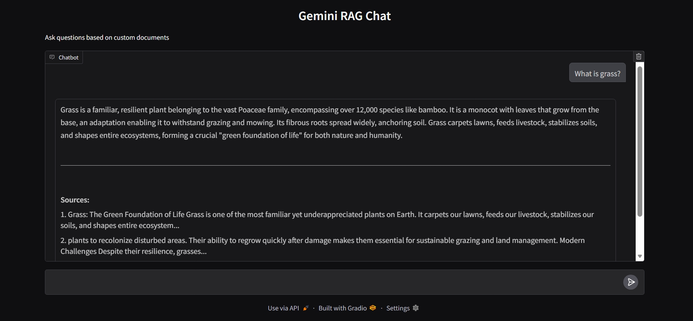

# Gemini RAG

A simple retrieval-augmented generation (RAG) app built with Gemini, ChromaDB, and Gradio.

The app retrieves relevant text chunks from stored documents and uses Gemini to generate grounded answers.
## KEY Highlight
This simple RAG app uses a rate-limit feature.Why?


Because local projects like this needs LLM calls using api and free end api's have limited tokens and resources which makes it crucial to restrict the wastage of these resources.


Gemini free tier has request limits. **Without rate limiting, sending requests too quickly can cause errors.**

That is why feature like rate limit makes this a possible practical project.

## Tech stack

- Python
- Google Gemini API
- ChromaDB
- Sentence Transformers
- Gradio

## Demo




## Project structure

```text
.
├── app.py
├── rag.py
├── ingestion.py
├── config.py
├── utils.py
├── requirements.txt
├── data/
│   └── docs.txt
└── chroma_db/
```

## Setup

Create a virtual environment:

```bash
python -m venv rag-env
```

Activate it:

Windows:

```bash
rag-env\Scripts\activate
```

Install dependencies:

```bash
pip install -r requirements.txt
```

Create a `.env` file:

```env
GEMINI_API_KEY=your_api_key
```

## Build database

Run:

```bash
python ingestion.py
```

This creates the local Chroma vector database.

## Run app

```bash
python app.py
```

The Gradio interface will open in your browser.

## How it works

1. Documents are split into chunks
2. Chunks are converted into embeddings
3. Embeddings are stored in ChromaDB
4. User query is embedded
5. Similar chunks are retrieved
6. Gemini generates an answer using retrieved context

## Notes

- Uses local embeddings (`all-MiniLM-L6-v2`)
- Uses Gemini only for answer generation
- Includes rate limiting for Gemini free tier

## Deployment

The project can be deployed on Hugging Face Spaces.

Add this secret in Space settings:

```env
GEMINI_API_KEY=your_api_key
```
